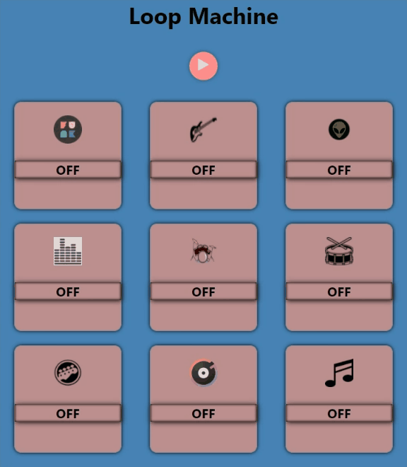
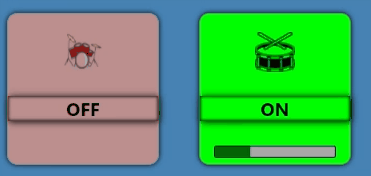
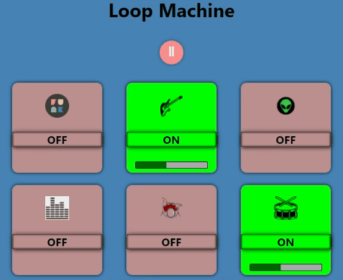

# Loop-machine

Loop-machine is an application that simulates a DJ board,
The board has pads with different sounds,
and you can create different music from them when you combine them differently

## Setup

Follow below steps to run project on your machine

1. Clone [this repository](https://github.com/ido-leybo/Loop-machine)
2. Run `npm install` command in the terminal to install dependencies
3. Execute `npm start` command to run the project

Reference Website: \*\* https://loop-machine1.herokuapp.com/ \*\*

## What the Loop-machine can do:

- The app has 9 pads and each has a different melody that lasts 8 seconds,

  

  By pressing a certain pad it switches to 'On' mode and waits for the board to turn on,
  until the board turn on the pad in 'pending' mode.

  You can click on several pads to play together.

  

- When the play button is clicked all the pads in 'on' mode will start playing at the same time,

  if we want to add another pad during play,

  click it and it will enter 'pending' mode until the 8 seconds are over and the loop restarts then it will start playing in sync with the other pads.

  

- If we want to turn off a particular pad then we can click on it and it will turn off immediately,

  

- if we want to turn off the whole board we press the pause button and it will basically reset the whole board immediately

  
